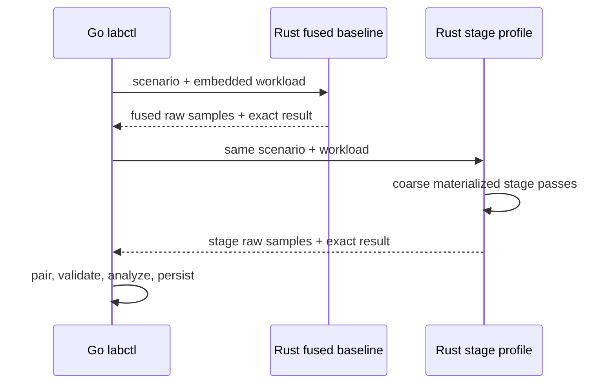
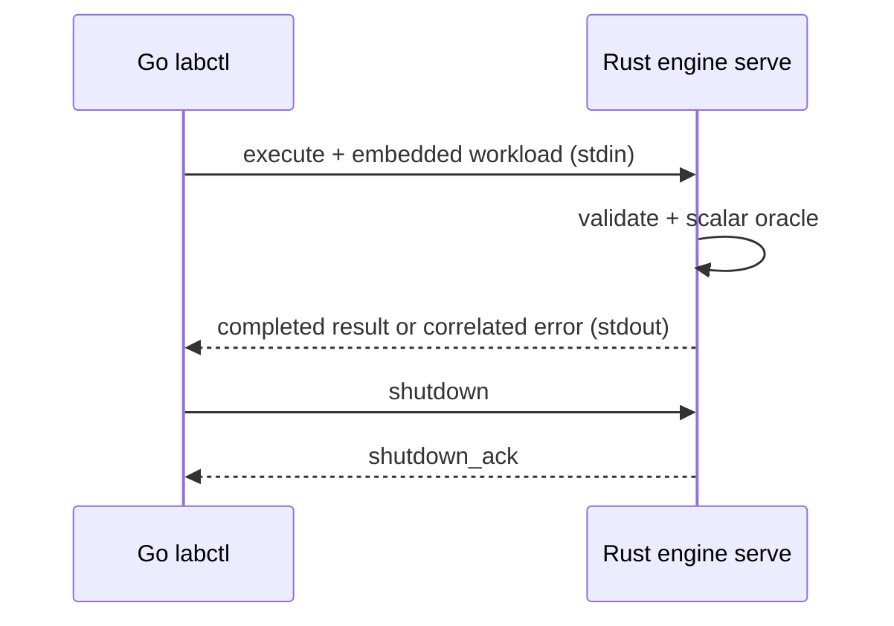
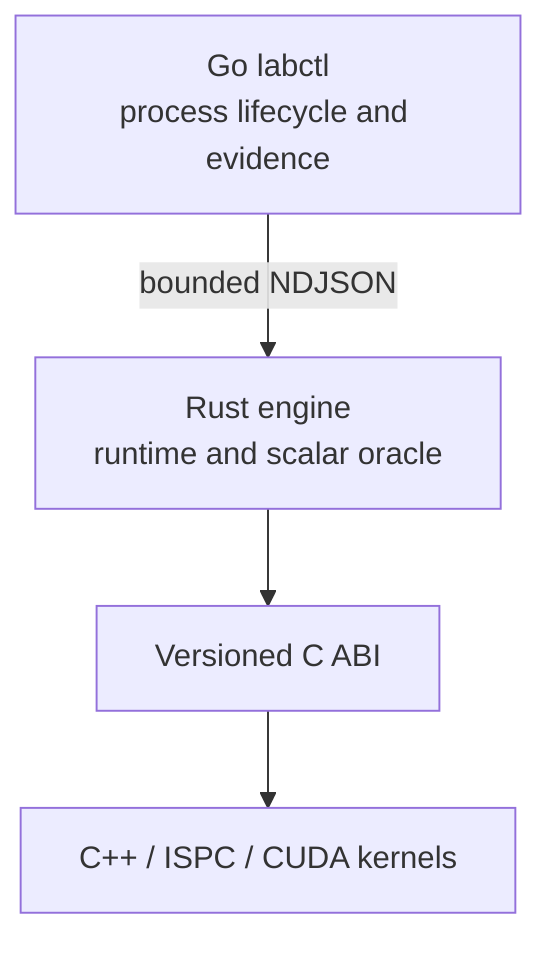

# ParaFlow

[](https://github.com/kvetinski/paraflow/actions/workflows/ci.yml)

ParaFlow is one evolving parallel-systems portfolio project built alongside
Stanford CS149. It begins with a measured scalar implementation and grows into
a Rust task-DAG runtime that schedules C++/ISPC/CUDA kernels, with a Go control
plane producing reproducible performance evidence.

```text
Go labctl
    | benchmark suites, process orchestration, evidence
    v
Rust ParaFlow engine
    | deterministic generation, scalar oracle, future scheduler
    v
C ABI
    |-- C++ scalar and SIMD
    |-- ISPC
    `-- CUDA
```

The stable workload is:

```text
seeded records -> normalize -> score -> filter/compact -> aggregate
```

This repository is not a collection of disconnected assignments. Every future
backend must preserve the same workload semantics and pass the same correctness
oracle before its performance is considered.

## Current milestone: Week 1 scalar release (`v0.1.0`)

Day 7 seals the scalar correctness and measurement foundation before any
optimization:

- `labctl verify` strictly decodes Day 5 captures and Day 6 paired reports;
- suite and workload paths are resolved inside an explicit repository root and
  their SHA-256 identities are checked against current bytes;
- raw engine results, timing conservation, source/build alignment, and
  orchestration boundaries are validated again;
- every median/MAD summary and every Day 6 analysis field is recomputed from
  retained raw samples;
- an explicitly supplied engine binary can be checked against the recorded
  digest; otherwise the receipt states that only its recorded identity was
  available;
- one root `VERSION` is checked against Go, all Rust workspace crates, Cargo
  metadata, and both release binaries;
- CI runs deterministic evidence and version gates plus a disposable paired
  smoke experiment without imposing a noisy timing threshold;
- adversarial tests prove unknown schemas/fields, rewritten summaries,
  repository drift, source drift, impossible timing, and binary mismatch fail
  closed and never rewrite evidence;
- a schema-checked Day 7 set adds 24 cumulative CS149 understanding questions.

No SIMD, multicore, task runtime, GPU, or speedup claim is introduced by this
release. The materialized Day 6 stage profile remains diagnostic rather than an
exact decomposition of the fused loop.

The complete implementation map, design, tests, benchmark setup, limitations,
and expected GitHub outcome are in
[`docs/plans/day-07.md`](docs/plans/day-07.md).

## Why the paired evidence is credible

Go does not time repeated pipe transactions as compute. For each scenario, it
sends one self-contained request to a fused benchmark process and one to a
diagnostic profile process. Rust owns both sample loops.



Per retained sample:

| Field             | Boundary                                                                                 |
| ----------------- | ---------------------------------------------------------------------------------------- |
| `generation_ns`   | allocation and deterministic materialization                                             |
| `pipeline_ns`     | normalize through aggregate over materialized records                                    |
| `engine_total_ns` | generation, pipeline, exact comparison, temporary-output reclamation, engine bookkeeping |

The profile adds `normalize_ns`, `score_ns`, `filter_ns`, `aggregate_ns`,
`stage_sum_ns`, and `profile_total_ns`. The exact stage sum is conserved and
the enclosing total may be larger. Both Rust responses include an
`experiment_total_ns`; Go records each process's `orchestration_total_ns`
separately.

Request and response payloads are bounded at 4 MiB; one optional LF or CRLF
terminator is excluded from that payload limit. All durations use exact
fixed-width hexadecimal nanoseconds. The complete contract is documented in
[`docs/specifications/benchmark-v1.md`](docs/specifications/benchmark-v1.md)
and [`docs/specifications/profile-v1.md`](docs/specifications/profile-v1.md).

## Correctness foundation

### Frozen workload semantics

The language-neutral [`workload-v1`](docs/specifications/workload-v1.md)
contract defines logical records, deterministic distributions, arithmetic
operation order, inclusive filtering, stable compaction, and aggregation.
Physical representation is deliberately not part of the contract.

### Schedule-independent input

Every generated field is a pure function of `(seed, absolute record index,
field ID)`. There is no shared RNG cursor, so later worker partitions can
generate disjoint ranges independently without changing record identity.

### Scalar oracle

Rust keeps typed stage transitions:

```rust
let normalized = normalize_record(record, &spec.pipeline.normalize);
let scored = score_record(normalized, &spec.pipeline.score);
let accepted = filter_record(scored, &spec.pipeline.filter);
```

The reference path streams records in stable input order and produces
`ResultV1`:

- accepted count;
- stable binary64 score sum;
- category histogram;
- wrapping accepted-ID sum;
- mixed accepted-ID XOR.

Day 5 adds an internal materialized execution path only for measurement. It
reuses the same stages and aggregator and does not expose `Vec<LogicalRecord>`
as a public layout or ABI.

### Lossless cross-language results

Every logical `u64` is transported as `0x` plus sixteen lowercase hexadecimal
digits. `score_sum` carries exact IEEE-754 binary64 bits, preserving signed zero
and positive infinity without JSON-number loss.

## Contract boundaries

## Versioned execution boundary



Go owns the `paraflow-engine serve` child process and keeps at most one request
in flight. A request embeds the complete workload instead of a local file path.
Frames are newline-delimited JSON with a 4 MiB payload limit; stdout is
protocol-only and stderr is drained into a bounded diagnostic tail.

Results are independently validated in Go before use. Every logical `u64` is
encoded as `0x` plus sixteen lowercase hexadecimal digits, and `score_sum`
carries exact IEEE-754 binary64 bits. A correlated invalid workload,
unsupported backend, or execution failure leaves the worker reusable.
Framing, transport, response-schema, correlation, or result-invariant failures
poison the session and cause Go to reap the child. Local request validation can
fail before any write without damaging the session. Requests are not
automatically retried after a write because their outcome may be unknown.

See the normative
[execution protocol](docs/specifications/execution-protocol-v1.md), its
[machine-readable schema](contracts/execution-protocol-v1.schema.json), and
[ADR 0005](docs/adr/0005-long-lived-versioned-worker-protocol.md).

## Architecture



| Component            | Responsibility today                                       | Future responsibility                  |
| -------------------- | ---------------------------------------------------------- | -------------------------------------- |
| `paraflow-contracts` | Workload types, stage order, validation                    | Shared semantic authority              |
| `paraflow-protocol`  | Lossless job/result transport types                        | Additional backend identifiers         |
| `paraflow-engine`    | Generation, oracle, fused benchmark, stage profiler        | Task DAG, scheduling, backend dispatch |
| `labctl`             | Diagnostics, orchestration, analysis, evidence persistence | Result indexing and comparison         |
| `abi`                | Documents boundary rules                                   | Narrow Rust-to-native C ABI            |
| `kernels-cpp`        | Documents scope only                                       | Scalar, SIMD, ISPC, and CUDA kernels   |


| Contract    | Responsibility                                            | Status                                               |
| ----------- | --------------------------------------------------------- | ---------------------------------------------------- |
| Workload    | What the computation means                                | `paraflow.workload/v1` frozen                        |
| Execution   | Reusable Go-to-Rust correctness transactions              | Day 4 protocol v1 frozen                             |
| Measurement | Fused warm-ups, samples, boundaries, and capture identity | Day 5 benchmark v1 frozen                            |
| Profiling   | Explicit observer/topology and paired scalar analysis     | Day 6 profile/report v1                              |
| Native ABI  | Rust-to-C++ buffer calls                                  | constraints documented; implementation begins Week 2 |

The Day 4 `serve` worker remains available for reusable correctness execution.
The Day 5 `benchmark` and Day 6 `profile` processes are separate so measurement
and diagnostic policies do not inflate or destabilize that protocol.

## Repository structure

```text
.
├── abi/                         # future narrow Rust-to-native C ABI
├── benchmarks/
│   └── suites/                  # versioned sampling scenarios
├── contracts/
│   ├── *.schema.json            # workload, execution, measurement schemas
│   └── conformance/             # portable exact fixtures
├── docs/
│   ├── adr/                     # architectural decisions
│   ├── architecture/            # system design
│   ├── plans/                   # milestone plans and acceptance gates
│   └── specifications/          # normative contracts
├── engine-rs/crates/
│   ├── paraflow-contracts/      # stable semantic authority
│   ├── paraflow-engine/         # generation, oracle, worker, benchmark loop
│   └── paraflow-protocol/       # lossless execution and measurement types
├── kernels-cpp/                 # C++/ISPC starts Week 2; CUDA later
├── labctl-go/                   # control plane and evidence persistence
├── results/
│   ├── day06/                   # curated paired scalar evidence
│   ├── day07/                   # deterministic verification receipt
│   └── raw/                     # ignored local immutable captures
├── tools/schema-check/          # pinned Draft 2020-12 validation
├── workloads/                   # semantic workload fixtures
└── VERSION                      # single Week 1 release version
```

## Requirements
- Git;
- Go 1.24 or newer;
- Rust 1.97.1 with `rustfmt` and `clippy`;
- a C compiler for race-enabled Go tests;
- Node.js 20 or newer with npm;
- Bash 4 or newer and GNU Make.

C++, ISPC, and CUDA are reported by `doctor` but are not required until their
roadmap weeks.

## Quick start

Run every deterministic quality gate:

```bash
make check
```

Run the complete Week 1 release qualification, including a disposable paired
profile:

```bash
make release-check
```

Inspect machine and toolchain readiness:

```bash
make go-build
./bin/labctl doctor
./bin/labctl doctor --json
```

Run one workload through the reusable Day 4 worker:

```bash
make rust-release-build go-build
./bin/labctl run \
  --engine ./target/release/paraflow-engine \
  workloads/edge-scalar-v1.json
```

Exercise the complete Day 5 boundary without retaining the output:

```bash
make benchmark-smoke
```

Persist the full raw scalar baseline:

```bash
make benchmark-day05
```

The command creates a unique file similar to:

```text
results/raw/day05-scalar-20260726T120000Z-0123456789ab.json
```

It refuses to overwrite an existing result.

Run the controller directly:

```bash
./bin/labctl benchmark \
  --engine ./target/release/paraflow-engine \
  --suite benchmarks/suites/day05-scalar-baseline-v1.json \
  --output results/raw/my-clean-baseline.json \
  --repository-root .
```

Only a release-profile engine result is accepted. Its embedded commit and
source state must match `labctl`, and its executable hash must remain unchanged
for the complete suite.

Exercise the paired Day 6 boundary without retaining its output:

```bash
make profile-smoke
```

Persist a full paired scalar profile:

```bash
make profile-day06
```

Or invoke the controller directly:

```bash
./bin/labctl profile \
  --engine ./target/release/paraflow-engine \
  --suite benchmarks/suites/day06-scalar-profile-v1.json \
  --output results/raw/my-day06-profile.json \
  --repository-root .
```

The report retains both topologies. The printed stage-pass/fused ratio describes
observer context and is never labeled a speedup.

The checked-in clean-run evidence and its interpretation are available in the
[Day 6 scalar baseline report](docs/reports/day06-scalar-baseline.md).

Replay every deterministic check over that historical evidence without
collecting new timing data:

```bash
make evidence-check

./bin/labctl verify \
  --json \
  --repository-root . \
  results/day06/day06-scalar-profile-df96257.json
```

Add `--engine ./target/release/paraflow-engine` only when verifying evidence
captured from those exact binary bytes. A normal rebuild from a later commit is
correctly expected to have a different digest.

Benchmark the verifier itself, independently from engine performance:

```bash
make evidence-benchmark
```

## Benchmark suites

| Suite                           | Purpose                                                        |
| ------------------------------- | -------------------------------------------------------------- |
| `day05-smoke-v1.json`           | disposable fused integration evidence                          |
| `day05-scalar-baseline-v1.json` | 1K, 64K uniform/hotspot, and 1M fused evidence                 |
| `day06-profile-smoke-v1.json`   | disposable paired fused/profile integration evidence           |
| `day06-scalar-profile-v1.json`  | 1K, 64K uniform/hotspot, and 1M paired stage-analysis evidence |

The two 64K workloads are identical except for the declared distribution, so
the skew experiment changes one controlled variable. The full suite runs
scenarios sequentially. It stores every sample and reports
median and MAD; it does not turn timing into a CI threshold.

## Testing strategy

`make check` covers:

- Draft 2020-12 schema validation and rejection cases;
- semantic validation of every workload;
- generator, scalar, execution, benchmark, profile, report, and question
  conformance fixtures;
- Rust formatting, Clippy, unit, integration, and release tests;
- Go formatting, `vet`, race-enabled tests, and source-identity build smoke;
- real release Go-to-Rust reusable-worker integration;
- real release Go-to-Rust benchmark integration;
- real release Go-to-Rust stage-profile integration;
- exact-limit LF/CRLF framing, unsupported-terminator rejection, and oversized-payload rejection;
- exact stage conservation, paired-result equality, source alignment, and
  engine-mutation rejection before persistence;
- offline replay of curated suite/workload identities, raw-result invariants,
  summaries, and integer-only analysis;
- adversarial evidence mutation tests and exact cross-language release-version
  alignment.

`make benchmark-smoke` and `make profile-smoke` additionally prove that complete
evidence can be produced in the current environment. They check structure and
correctness only, never a fixed latency.

## Evidence and limitations

The `v0.1.0` checkpoint makes a Day 6 report independently auditable, but its
performance interpretation still has explicit limitations:

- no CPU pinning or NUMA policy;
- no forced frequency or turbo policy;
- no hardware-counter attribution yet;
- the generation boundary includes allocation;
- the pipeline boundary uses the current scalar materialized representation;
- profile stage passes add intermediate allocations and lose fused-loop memory
  behavior;
- boundary timers perturb the diagnostic topology;
- scenarios use separate processes, so they do not share warmed allocator or
  calibration state;
- one machine's timings do not generalize automatically to another.

1. deterministic generation — **complete**;
2. scalar Rust correctness oracle — **complete**;
3. Go-to-Rust experiment protocol — **complete**;
4. reproducible benchmark harness — **complete**;
5. observer-aware scalar profiling and analysis — **complete**;
6. offline evidence verification and scalar release qualification — **complete**;
7. SIMD/ISPC kernels;
8. multicore task execution and scheduling;
9. CUDA and heterogeneous execution.

These are not hidden defects. They define the questions later layout and runtime
experiments must answer. `make profile-day06` produces a fresh report on the
machine whose metadata it records.

See [`docs/benchmark-methodology.md`](docs/benchmark-methodology.md) and
[ADR 0006](docs/adr/0006-engine-owned-sampling-and-immutable-captures.md).

## Architecture decisions

- [ADR 0001 — Language ownership](docs/adr/0001-language-ownership.md)
- [ADR 0002 — Logical contract before layout](docs/adr/0002-logical-contract-before-layout.md)
- [ADR 0003 — Counter-derived generation](docs/adr/0003-counter-derived-generation.md)
- [ADR 0004 — Typed streaming scalar oracle](docs/adr/0004-typed-streaming-scalar-oracle.md)
- [ADR 0005 — Long-lived versioned worker protocol](docs/adr/0005-long-lived-versioned-worker-protocol.md)
- [ADR 0006 — Engine-owned sampling and immutable captures](docs/adr/0006-engine-owned-sampling-and-immutable-captures.md)
- [ADR 0007 — Observer-aware scalar profiling](docs/adr/0007-observer-aware-scalar-profiling.md)
- [ADR 0008 — Offline verification and release qualification](docs/adr/0008-offline-verification-and-release-qualification.md)

## Next milestone

Week 2 introduces the narrow native ABI and a C++ scalar backend against the
tagged `v0.1.0` Rust oracle. SIMD work begins only after the C++ scalar path
matches every existing workload and result invariant.
