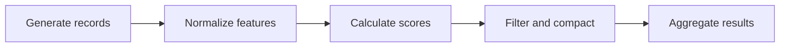
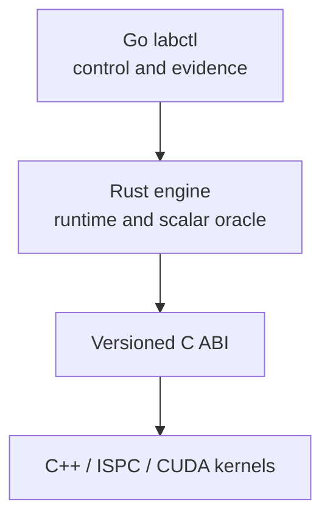

# ParaFlow

[](https://github.com/kvetinski/paraflow/actions/workflows/ci.yml)

ParaFlow is a twelve-week parallel-systems engineering project built alongside
Stanford CS149. One workload and one repository evolve from a scalar reference
into a heterogeneous task-DAG runtime.

This is not a directory of disconnected course solutions. ParaFlow is original
portfolio work designed to make every performance claim reproducible and every
optimization comparable with the same correctness oracle.

## Current milestone: Day 2

Day 1 established the semantic and measurement foundation. Day 2 now provides
the first executable workload stage:

- a versioned, language-neutral workload contract;
- a Rust contract library with accumulated semantic validation;
- pure wrapping `splitmix64-v1` sampling by seed, absolute index, and field;
- validated random-access generation plus lazy and range-based APIs;
- uniform and hotspot datasets with exact cross-language conformance vectors;
- safe behavior for empty, single, large, and non-materializable batches;
- a Go `labctl doctor` command that captures environment and toolchain
  readiness;
- a frozen logical pipeline with uniform and skewed smoke workloads;
- architecture decisions, benchmark rules, tests, and CI quality gates;
- explicit extension boundaries for future C++/ISPC/CUDA kernels.

There is still no normalize-through-aggregate execution or published timing
result. The release-build preflight now exercises a real generation boundary,
but sampling and baseline capture remain Day 5 work; the first analyzed report
is published on Day 6.

## Stable workload



The logical record contains an ID, category, two integer features, and flags.
Physical representation is deliberately unresolved: later weeks can compare
array-of-structs, structure-of-arrays, aligned buffers, and device memory
without changing workload meaning.

The complete semantics are in
[workload-v1.md](docs/specifications/workload-v1.md). The machine-readable
schema is [workload-v1.schema.json](contracts/workload-v1.schema.json).

## Deterministic generation

Every generated field is a pure function of `(seed, record index, field ID)`.
There is no shared RNG state, so visiting indices forward, backward, or in
future worker-sized partitions produces identical records.

Manifest seeds and record counts are capped at `2^53−1`, the largest integer
all supported JSON consumers preserve exactly. The underlying generator still
defines full-width `u64` wrapping behavior, locked by hexadecimal vectors.

The Rust API keeps random access fundamental:

```rust
let generator = DatasetGenerator::try_new(&spec.dataset)?;
let record = generator.record_at(42);
let partition = generator.generate_range(1_000..2_000)?;
```

`generate_range` currently returns a scalar reference `Vec<LogicalRecord>`.
That is not a frozen AoS layout or ABI. Later backends can materialize the same
absolute indices into SoA, aligned, or device-specific buffers.

Exact [`splitmix64-v1` vectors](contracts/conformance/splitmix64-v1.json) lock
wrapping behavior, field identifiers, and selected full-record outputs across
uniform, hotspot, and edge-case workloads. Their `u64` values are fixed-width
hexadecimal strings to remain lossless in every JSON consumer.

## Architecture



| Component | Responsibility today | Future responsibility |
| --- | --- | --- |
| `paraflow-contracts` | Workload types, stage order, validation | Shared semantic authority |
| `paraflow-engine` | Manifest validation and deterministic generation | Scalar oracle, task DAG, scheduling |
| `labctl` | Environment diagnostics | Experiment orchestration and evidence capture |
| `abi` | Documents boundary rules | Narrow Rust-to-native C ABI |
| `kernels-cpp` | Documents scope only | Scalar, SIMD, ISPC, and CUDA kernels |

Go never enters the measured compute path. Rust owns orchestration and
correctness. C++ is introduced only when there is meaningful low-level work to
perform.

See [architecture/overview.md](docs/architecture/overview.md) and the accepted
[language-ownership ADR](docs/adr/0001-language-ownership.md).

## Repository structure

```text
.
├── abi/                    # Future C ABI rules, not a premature layout
├── benchmarks/             # Methodology and future experiment definitions
├── contracts/              # Schemas and portable conformance vectors
├── docs/
│   ├── adr/                # Architectural decisions
│   ├── architecture/       # System design
│   ├── plans/              # Execution plan and milestone boundaries
│   └── specifications/     # Normative workload behavior
├── engine-rs/
│   └── crates/
│       ├── paraflow-contracts/
│       └── paraflow-engine/
├── kernels-cpp/            # C++/ISPC/CUDA begins in Week 2
├── labctl-go/              # Go experiment controller
├── results/                # Curated, attributable performance evidence
├── tools/schema-check/     # Pinned Draft 2020-12 validation tooling
└── workloads/              # Versioned semantic workloads
```

## Quick start

Required for Day 2:

- Git;
- Go 1.24 or newer;
- Rust 1.88 with `rustfmt` and `clippy`;
- a C compiler (`cc`) for race-enabled Go tests;
- Node.js 20 or newer with npm, used only for Draft 2020-12 contract checks;
- Bash 4 or newer and GNU Make.

Inspect the contract:

```bash
cargo run -p paraflow-engine -- contract
```

Validate the checked-in workload:

```bash
cargo run -p paraflow-engine -- \
  validate workloads/smoke-uniform-v1.json
```

Verify deterministic generation, boundary behavior, and portable vectors:

```bash
make generation-check
```

Inspect environment readiness:

```bash
go run ./labctl-go/cmd/labctl doctor
go run ./labctl-go/cmd/labctl doctor --json
```

Run all quality gates:

```bash
make check
```

Run the release-build, non-timing benchmark readiness check:

```bash
make benchmark-preflight
```

GitHub Actions runs the equivalent contract, Rust, and Go correctness gates.
Timing thresholds remain deliberately local.

## Testing strategy

- Rust contract tests enforce schema parsing, accumulated semantic errors,
  stage order, round-trip behavior, and empty-workload semantics.
- Rust generation tests enforce literal SplitMix vectors, exact generated
  records, repeated and partitioned identity, full-width feature arithmetic,
  probability boundaries, safe range failures, and lazy huge datasets.
- Rust CLI tests exercise valid, malformed, and missing files plus exact command
  exit behavior.
- Go tests inject tool probes and verify failed, timed-out, and outdated
  toolchains cannot report false readiness.
- Every workload is checked against the Draft 2020-12 JSON Schema and the Rust
  semantic validator.
- CI tests correctness only; performance thresholds do not belong on shared
  runners.

## Benchmark integrity

ParaFlow does not accept a naked “N× faster” claim. A publishable result must
include the Git commit, workload identity, release flags, machine and toolchain
metadata, raw samples, timing boundaries, correctness status, and the slower
cases as well as the wins.

The full policy is in
[benchmark-methodology.md](docs/benchmark-methodology.md). Day 1 provides a
benchmark policy; Day 2 adds release-build and generator-conformance preflight,
not premature timing samples or an artificial benchmark of configuration
parsing.

## Roadmap

The repository will evolve without replacing the workload:

1. deterministic generation — **complete**;
2. scalar Rust correctness oracle;
3. Go-to-Rust experiment protocol;
4. reproducible benchmark harness;
5. profiling and the first performance report;
6. SIMD/ISPC kernels;
7. multicore task execution and scheduling;
8. CUDA and heterogeneous execution.

The current implementation boundary is recorded in
[week-01.md](docs/plans/week-01.md).

## Course-work separation

Stanford assignments are learning inputs, not public portfolio content.
ParaFlow does not include completed CS149 handouts or assignment solutions.

## License

Licensed under the Apache License, Version 2.0. See [LICENSE](LICENSE).
