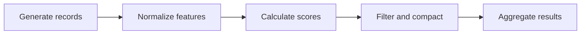
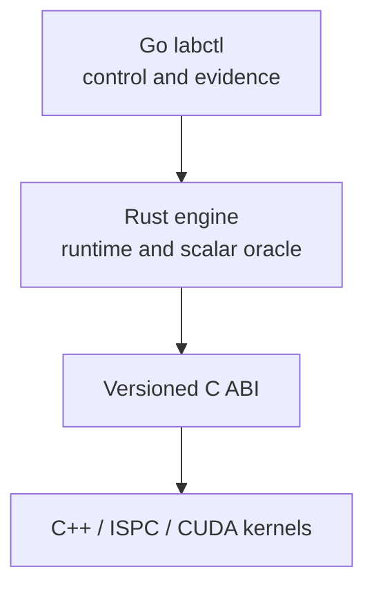

# ParaFlow

[](https://github.com/kvetinski/paraflow/actions/workflows/ci.yml)

ParaFlow is a twelve-week parallel-systems engineering project built alongside
Stanford CS149. One workload and one repository evolve from a scalar reference
into a heterogeneous task-DAG runtime.

This is not a directory of disconnected course solutions. ParaFlow is original
portfolio work designed to make every performance claim reproducible and every
optimization comparable with the same correctness oracle.

## Current milestone: Day 1

Day 1 establishes the semantic and measurement foundation:

- a versioned, language-neutral workload contract;
- a Rust contract library with accumulated semantic validation;
- a Rust CLI that reports and validates the contract, but does not pretend to
  execute it yet;
- a Go `labctl doctor` command that captures environment and toolchain
  readiness;
- a frozen logical pipeline with a valid smoke workload;
- architecture decisions, benchmark rules, tests, and CI quality gates;
- explicit extension boundaries for future C++/ISPC/CUDA kernels.

No runtime benchmark is published yet because no compute path exists. The first
performance baseline belongs to Day 5, after deterministic generation and the
scalar oracle are implemented.

## Stable workload



The logical record contains an ID, category, two integer features, and flags.
Physical representation is deliberately unresolved: later weeks can compare
array-of-structs, structure-of-arrays, aligned buffers, and device memory
without changing workload meaning.

The complete semantics are in
[workload-v1.md](docs/specifications/workload-v1.md). The machine-readable
schema is [workload-v1.schema.json](contracts/workload-v1.schema.json).

## Architecture



| Component | Responsibility today | Future responsibility |
| --- | --- | --- |
| `paraflow-contracts` | Workload types, stage order, validation | Shared semantic authority |
| `paraflow-engine` | Contract inspection and manifest validation | Scalar oracle, task DAG, scheduling |
| `labctl` | Environment diagnostics | Experiment orchestration and evidence capture |
| `abi` | Documents boundary rules | Narrow Rust-to-native C ABI |
| `kernels-cpp` | Documents scope only | Scalar, SIMD, ISPC, and CUDA kernels |

Go never enters the measured compute path. Rust owns orchestration and
correctness. C++ is introduced only when there is meaningful low-level work to
perform.

See [architecture/overview.md](docs/architecture/overview.md) and the accepted
[language-ownership ADR](docs/adr/0001-language-ownership.md).

## Repository structure

```text
.
├── abi/                    # Future C ABI rules, not a premature layout
├── benchmarks/             # Methodology and future experiment definitions
├── contracts/              # Machine-readable workload schema
├── docs/
│   ├── adr/                # Architectural decisions
│   ├── architecture/       # System design
│   ├── plans/              # Execution plan and milestone boundaries
│   └── specifications/     # Normative workload behavior
├── engine-rs/
│   └── crates/
│       ├── paraflow-contracts/
│       └── paraflow-engine/
├── kernels-cpp/            # C++/ISPC/CUDA begins in Week 2
├── labctl-go/              # Go experiment controller
├── results/                # Curated, attributable performance evidence
└── workloads/              # Versioned semantic workloads
```

## Quick start

Required for Day 1:

- Git;
- Go 1.24 or newer;
- Rust 1.88 with `rustfmt` and `clippy`;
- GNU Make.

Inspect the contract:

```bash
cargo run -p paraflow-engine -- contract
```

Validate the checked-in workload:

```bash
cargo run -p paraflow-engine -- \
  validate workloads/smoke-uniform-v1.json
```

Inspect environment readiness:

```bash
go run ./labctl-go/cmd/labctl doctor
go run ./labctl-go/cmd/labctl doctor --json
```

Run all quality gates:

```bash
make check
```

The same targets run in GitHub Actions.

## Testing strategy

- Rust contract tests enforce schema parsing, accumulated semantic errors,
  stage order, round-trip behavior, and empty-workload semantics.
- Rust CLI tests enforce command and manifest-validation boundaries.
- Go tests inject tool probes so readiness behavior does not depend on the test
  host.
- JSON files are syntax-checked independently.
- CI tests correctness only; performance thresholds do not belong on shared
  runners.

## Benchmark integrity

ParaFlow does not accept a naked “N× faster” claim. A publishable result must
include the Git commit, workload identity, release flags, machine and toolchain
metadata, raw samples, timing boundaries, correctness status, and the slower
cases as well as the wins.

The full policy is in
[benchmark-methodology.md](docs/benchmark-methodology.md). Day 1 provides a
benchmark preflight, not an artificial benchmark of configuration parsing.

## Roadmap

The repository will evolve without replacing the workload:

1. deterministic generation;
2. scalar Rust correctness oracle;
3. Go-to-Rust experiment protocol;
4. reproducible benchmark harness;
5. profiling and the first performance report;
6. SIMD/ISPC kernels;
7. multicore task execution and scheduling;
8. CUDA and heterogeneous execution.

The current implementation boundary is recorded in
[week-01.md](docs/plans/week-01.md).

## Course-work separation

Stanford assignments are learning inputs, not public portfolio content.
ParaFlow does not include completed CS149 handouts or assignment solutions.

## License

Licensed under the Apache License, Version 2.0. See [LICENSE](LICENSE).
