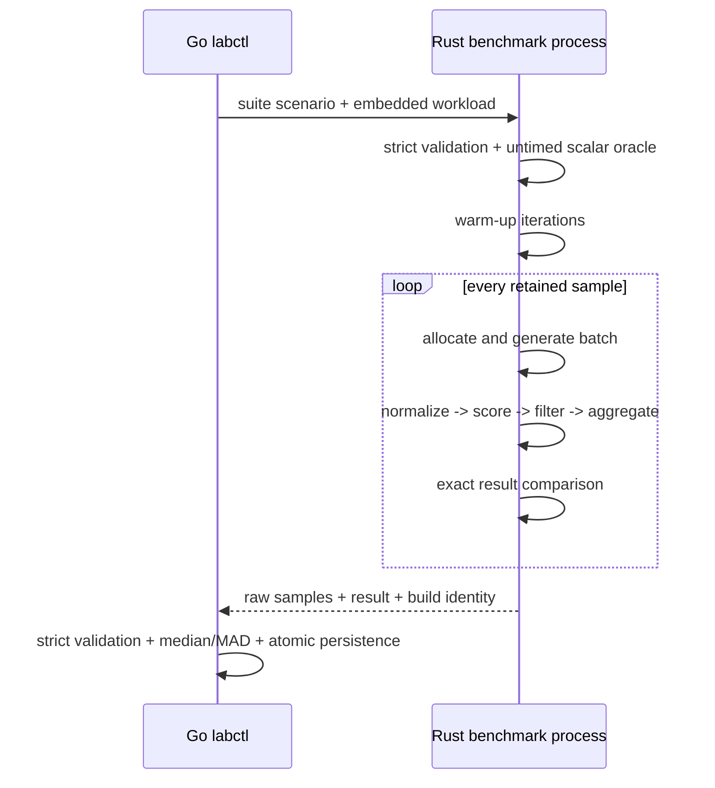
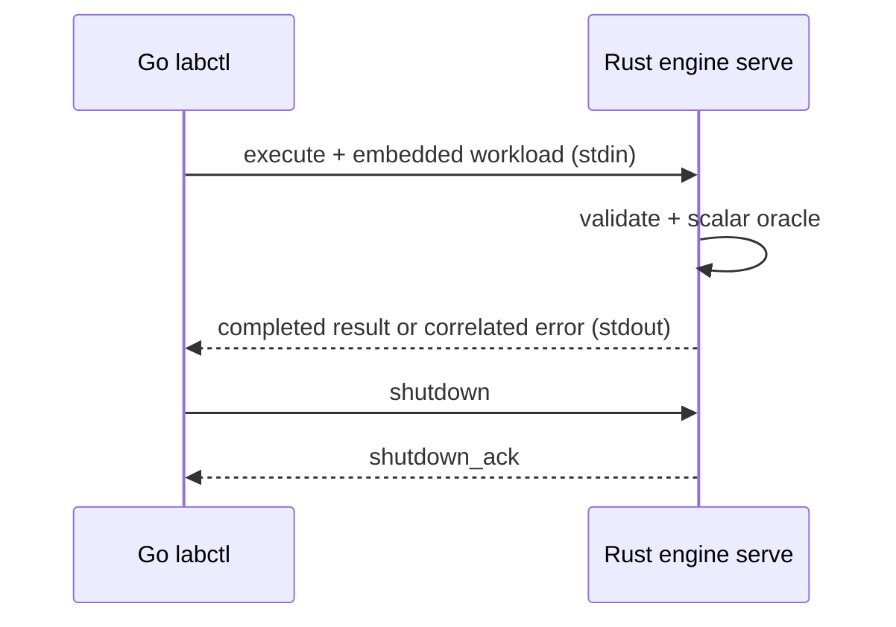
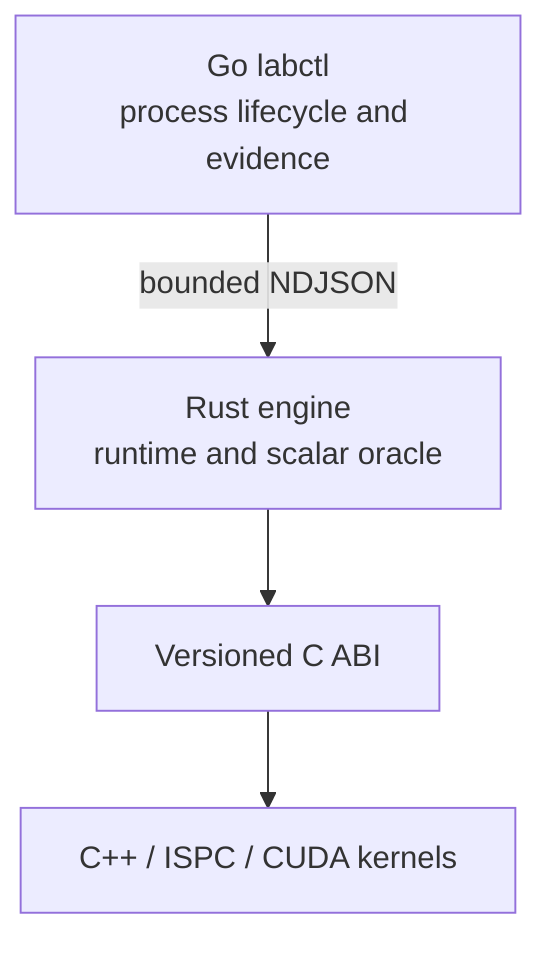

# ParaFlow

[](https://github.com/kvetinski/paraflow/actions/workflows/ci.yml)

ParaFlow is one evolving parallel-systems portfolio project built alongside
Stanford CS149. It begins with a measured scalar implementation and grows into
a Rust task-DAG runtime that schedules C++/ISPC/CUDA kernels, with a Go control
plane producing reproducible performance evidence.

```text
Go labctl
    | benchmark suites, process orchestration, evidence
    v
Rust ParaFlow engine
    | deterministic generation, scalar oracle, future scheduler
    v
C ABI
    |-- C++ scalar and SIMD
    |-- ISPC
    `-- CUDA
```

The stable workload is:

```text
seeded records -> normalize -> score -> filter/compact -> aggregate
```

This repository is not a collection of disconnected assignments. Every future
backend must preserve the same workload semantics and pass the same correctness
oracle before its performance is considered.

## Current milestone: Day 5

Day 5 ships a reproducible scalar benchmark harness:

- versioned benchmark suite, request, engine-result, environment, and capture
  schemas;
- one fresh Rust process per scenario;
- all warm-ups and retained samples executed inside that process;
- process startup excluded from individual engine samples and retained in a
  separate Go orchestration boundary;
- distinct generation, pipeline, engine-total, experiment-total, and
  orchestration-total durations;
- fresh deterministic materialization for every iteration;
- exact comparison of every materialized iteration with the frozen streaming
  scalar oracle;
- strict Go validation of correlation, build profile, sample order, timing
  conservation, encodings, and logical result invariants;
- exact controller/engine source-commit and source-state alignment;
- engine hashing before and after the suite so a replaced binary cannot produce a
  mixed capture;
- every raw sample retained;
- integer median, median absolute deviation, minimum, and maximum summaries;
- SHA-256 identity for the suite, workloads, and measured engine executable;
- controller, engine, source-state, host, CPU, OS, and toolchain metadata;
- atomic no-overwrite persistence of complete captures;
- a disposable CI smoke suite with no performance threshold;
- a full local baseline suite spanning 1K, 64K uniform, 64K hotspot, and 1M
  records.

Day 5 establishes the denominator for future comparisons. It makes no SIMD,
multicore, or GPU speedup claim. Day 6 profiles and explains the scalar baseline
before optimization begins.

The implementation map, test inventory, benchmark setup, and commit structure
are collected in [`DAY5_IMPLEMENTATION.md`](DAY5_IMPLEMENTATION.md).

## Why the measurement boundary is credible

The Go controller does not time repeated pipe transactions. It sends one
self-contained request to `paraflow-engine benchmark`; Rust performs the entire
sample loop in process.



Per retained sample:

| Field             | Boundary                                                                                 |
| ----------------- | ---------------------------------------------------------------------------------------- |
| `generation_ns`   | allocation and deterministic materialization                                             |
| `pipeline_ns`     | normalize through aggregate over materialized records                                    |
| `engine_total_ns` | generation, pipeline, exact comparison, temporary-output reclamation, engine bookkeeping |

The Rust response also includes `experiment_total_ns` for all warm-ups and
samples. Go separately records `orchestration_total_ns`, which includes request
encoding, process launch, transport, execution, response decoding, and
validation.

Request and response payloads are bounded at 4 MiB; one optional LF or CRLF
terminator is excluded from that payload limit. All durations use exact
fixed-width hexadecimal nanoseconds. The complete contract is documented in
[`docs/specifications/benchmark-v1.md`](docs/specifications/benchmark-v1.md).

## Correctness foundation

### Frozen workload semantics

The language-neutral [`workload-v1`](docs/specifications/workload-v1.md)
contract defines logical records, deterministic distributions, arithmetic
operation order, inclusive filtering, stable compaction, and aggregation.
Physical representation is deliberately not part of the contract.

### Schedule-independent input

Every generated field is a pure function of `(seed, absolute record index,
field ID)`. There is no shared RNG cursor, so later worker partitions can
generate disjoint ranges independently without changing record identity.

### Scalar oracle

Rust keeps typed stage transitions:

```rust
let normalized = normalize_record(record, &spec.pipeline.normalize);
let scored = score_record(normalized, &spec.pipeline.score);
let accepted = filter_record(scored, &spec.pipeline.filter);
```

The reference path streams records in stable input order and produces
`ResultV1`:

- accepted count;
- stable binary64 score sum;
- category histogram;
- wrapping accepted-ID sum;
- mixed accepted-ID XOR.

Day 5 adds an internal materialized execution path only for measurement. It
reuses the same stages and aggregator and does not expose `Vec<LogicalRecord>`
as a public layout or ABI.

### Lossless cross-language results

Every logical `u64` is transported as `0x` plus sixteen lowercase hexadecimal
digits. `score_sum` carries exact IEEE-754 binary64 bits, preserving signed zero
and positive infinity without JSON-number loss.

## Contract boundaries

## Versioned execution boundary



Go owns the `paraflow-engine serve` child process and keeps at most one request
in flight. A request embeds the complete workload instead of a local file path.
Frames are newline-delimited JSON with a 4 MiB payload limit; stdout is
protocol-only and stderr is drained into a bounded diagnostic tail.

Results are independently validated in Go before use. Every logical `u64` is
encoded as `0x` plus sixteen lowercase hexadecimal digits, and `score_sum`
carries exact IEEE-754 binary64 bits. A correlated invalid workload,
unsupported backend, or execution failure leaves the worker reusable.
Framing, transport, response-schema, correlation, or result-invariant failures
poison the session and cause Go to reap the child. Local request validation can
fail before any write without damaging the session. Requests are not
automatically retried after a write because their outcome may be unknown.

See the normative
[execution protocol](docs/specifications/execution-protocol-v1.md), its
[machine-readable schema](contracts/execution-protocol-v1.schema.json), and
[ADR 0005](docs/adr/0005-long-lived-versioned-worker-protocol.md).

## Architecture



| Component            | Responsibility today                                       | Future responsibility                  |
| -------------------- | ---------------------------------------------------------- | -------------------------------------- |
| `paraflow-contracts` | Workload types, stage order, validation                    | Shared semantic authority              |
| `paraflow-protocol`  | Lossless job/result transport types                        | Additional backend identifiers         |
| `paraflow-engine`    | Deterministic generation, scalar oracle, long-lived worker | Task DAG, scheduling, backend dispatch |
| `labctl`             | Diagnostics and Rust process orchestration                 | Sampling and evidence capture          |
| `abi`                | Documents boundary rules                                   | Narrow Rust-to-native C ABI            |
| `kernels-cpp`        | Documents scope only                                       | Scalar, SIMD, ISPC, and CUDA kernels   |


| Contract    | Responsibility                                         | Status                                               |
| ----------- | ------------------------------------------------------ | ---------------------------------------------------- |
| Workload    | What the computation means                             | `paraflow.workload/v1` frozen                        |
| Execution   | Reusable Go-to-Rust correctness transactions           | Day 4 protocol v1 frozen                             |
| Measurement | Warm-ups, samples, timing boundaries, capture identity | Day 5 benchmark v1 frozen                            |
| Native ABI  | Rust-to-C++ buffer calls                               | constraints documented; implementation begins Week 2 |

The Day 4 `serve` worker remains available for reusable correctness execution.
The Day 5 one-shot `benchmark` process is separate so measurement policy does
not inflate or destabilize the execution protocol.

## Repository structure

```text
.
├── abi/                         # future narrow Rust-to-native C ABI
├── benchmarks/
│   └── suites/                  # versioned sampling scenarios
├── contracts/
│   ├── *.schema.json            # workload, execution, measurement schemas
│   └── conformance/             # portable exact fixtures
├── docs/
│   ├── adr/                     # architectural decisions
│   ├── architecture/            # system design
│   ├── plans/                   # milestone plans and acceptance gates
│   └── specifications/          # normative contracts
├── engine-rs/crates/
│   ├── paraflow-contracts/      # stable semantic authority
│   ├── paraflow-engine/         # generation, oracle, worker, benchmark loop
│   └── paraflow-protocol/       # lossless execution and measurement types
├── kernels-cpp/                 # C++/ISPC starts Week 2; CUDA later
├── labctl-go/                   # control plane and evidence persistence
├── results/raw/                 # ignored local immutable captures
├── tools/schema-check/          # pinned Draft 2020-12 validation
└── workloads/                   # semantic workload fixtures
```

## Requirements
- Git;
- Go 1.24 or newer;
- Rust 1.88 with `rustfmt` and `clippy`;
- a C compiler for race-enabled Go tests;
- Node.js 20 or newer with npm;
- Bash 4 or newer and GNU Make.

C++, ISPC, and CUDA are reported by `doctor` but are not required until their
roadmap weeks.

## Quick start

Run every deterministic quality gate:

```bash
make check
```

Inspect machine and toolchain readiness:

```bash
make go-build
./bin/labctl doctor
./bin/labctl doctor --json
```

Run one workload through the reusable Day 4 worker:

```bash
make rust-release-build go-build
./bin/labctl run \
  --engine ./target/release/paraflow-engine \
  workloads/edge-scalar-v1.json
```

Exercise the complete Day 5 boundary without retaining the output:

```bash
make benchmark-smoke
```

Persist the full raw scalar baseline:

```bash
make benchmark-day05
```

The command creates a unique file similar to:

```text
results/raw/day05-scalar-20260726T120000Z-0123456789ab.json
```

It refuses to overwrite an existing result.

Run the controller directly:

```bash
./bin/labctl benchmark \
  --engine ./target/release/paraflow-engine \
  --suite benchmarks/suites/day05-scalar-baseline-v1.json \
  --output results/raw/my-clean-baseline.json \
  --repository-root .
```

Only a release-profile engine result is accepted. Its embedded commit and
source state must match `labctl`, and its executable hash must remain unchanged
for the complete suite.

## Benchmark suites

| Suite                           | Purpose                                                |
| ------------------------------- | ------------------------------------------------------ |
| `day05-smoke-v1.json`           | one warm-up and three 1K samples; integration/CI only  |
| `day05-scalar-baseline-v1.json` | 1K, 64K uniform, 64K hotspot, and 1M baseline evidence |

The two 64K workloads are identical except for the declared distribution, so
the skew experiment changes one controlled variable. The full suite runs
scenarios sequentially. It stores every sample and reports
median and MAD; it does not turn timing into a CI threshold.

## Testing strategy

`make check` covers:

- Draft 2020-12 schema validation and rejection cases;
- semantic validation of every workload;
- generator, scalar, execution, and benchmark conformance fixtures;
- Rust formatting, Clippy, unit, integration, and release tests;
- Go formatting, `vet`, race-enabled tests, and source-identity build smoke;
- real release Go-to-Rust reusable-worker integration;
- real release Go-to-Rust benchmark integration;
- exact-limit LF/CRLF framing, unsupported-terminator rejection, and oversized-payload rejection;
- source-alignment and engine-mutation rejection before persistence.

`make benchmark-smoke` additionally proves that a complete capture can be
produced in the current environment. It checks structure and correctness only,
never a fixed latency.

## Evidence and limitations

A Day 5 capture records enough identity to reproduce the experiment, but the
baseline still has explicit limitations:

- no CPU pinning or NUMA policy;
- no forced frequency or turbo policy;
- no hardware-counter attribution yet;
- the generation boundary includes allocation;
- the pipeline boundary uses the current scalar materialized representation;
- scenarios use separate processes, so they do not share warmed allocator or
  calibration state;
- one machine's timings do not generalize automatically to another.

1. deterministic generation — **complete**;
2. scalar Rust correctness oracle — **complete**;
3. Go-to-Rust experiment protocol — **complete**;
4. reproducible benchmark harness;
5. profiling and the first performance report;
6. SIMD/ISPC kernels;
7. multicore task execution and scheduling;
8. CUDA and heterogeneous execution.

These are not hidden defects. They define the questions Day 6 profiling and
later layout/runtime experiments must answer. The repository intentionally
ships no fabricated machine timings; `make benchmark-day05` produces the first
raw capture on the machine whose metadata it records.

See [`docs/benchmark-methodology.md`](docs/benchmark-methodology.md) and
[ADR 0006](docs/adr/0006-engine-owned-sampling-and-immutable-captures.md).

## Architecture decisions

- [ADR 0001 — Language ownership](docs/adr/0001-language-ownership.md)
- [ADR 0002 — Logical contract before layout](docs/adr/0002-logical-contract-before-layout.md)
- [ADR 0003 — Counter-derived generation](docs/adr/0003-counter-derived-generation.md)
- [ADR 0004 — Typed streaming scalar oracle](docs/adr/0004-typed-streaming-scalar-oracle.md)
- [ADR 0005 — Long-lived versioned worker protocol](docs/adr/0005-long-lived-versioned-worker-protocol.md)
- [ADR 0006 — Engine-owned sampling and immutable captures](docs/adr/0006-engine-owned-sampling-and-immutable-captures.md)

## Next milestone

Day 6 consumes a clean Day 5 capture, adds stage-level profiling evidence, and
publishes the first baseline analysis. No optimization is chosen until the
profile identifies where time is actually spent.
