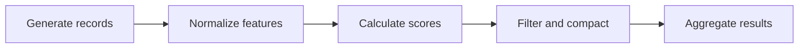
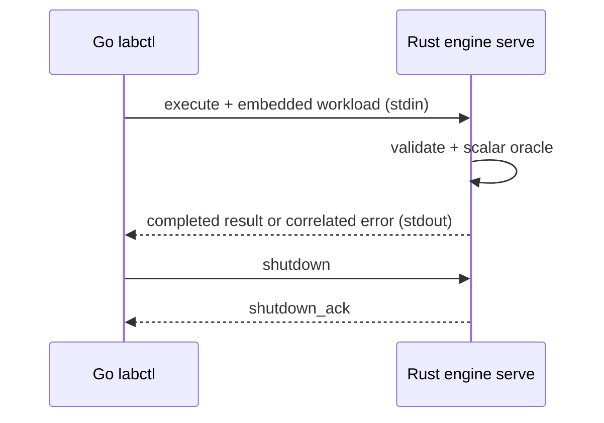
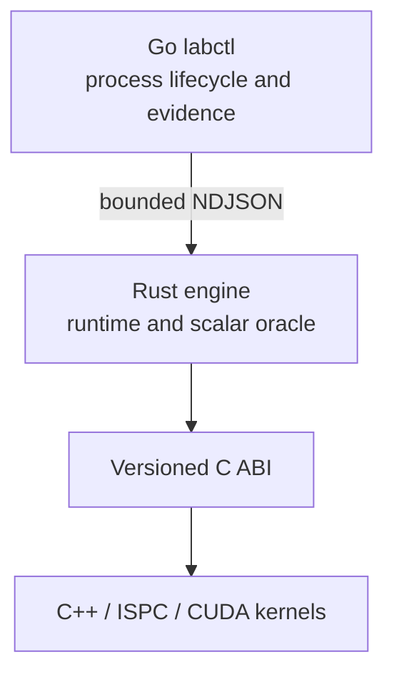

# ParaFlow

[](https://github.com/kvetinski/paraflow/actions/workflows/ci.yml)

ParaFlow is a twelve-week parallel-systems engineering project built alongside
Stanford CS149. One workload and one repository evolve from a scalar reference
into a heterogeneous task-DAG runtime.

This is not a directory of disconnected course solutions. ParaFlow is original
portfolio work designed to make every performance claim reproducible and every
optimization comparable with the same correctness oracle.

## Current milestone: Day 4

Days 1–3 established the workload contract, deterministic generation, and the
Rust scalar correctness oracle. Day 4 connects that oracle to the Go control
plane through a reusable process boundary:

- a versioned, language-neutral workload contract;
- a Rust contract library with accumulated semantic validation;
- pure wrapping `splitmix64-v1` sampling by seed, absolute index, and field;
- validated random-access generation plus lazy and range-based APIs;
- typed normalize, score, and inclusive filter stages with explicit `f32`
  operation order;
- stable compaction and canonical aggregation into `ResultV1`;
- optional accepted-ID diagnostics without putting them in the canonical
  result;
- uniform, hotspot, empty, generator-edge, and scalar-edge workloads with exact
  bit-pattern conformance vectors;
- strict `paraflow.job/v1`, `paraflow.job-result/v1`, and
  `paraflow.result/v1` envelopes with portable conformance vectors;
- a bounded 4 MiB NDJSON stream to one long-lived Rust `serve` worker;
- Go-owned process lifecycle, correlation, cancellation, stderr capture, and
  explicit graceful shutdown;
- one in-flight embedded-workload request at a time, using the `scalar`
  backend;
- lossless fixed-width hexadecimal `u64` values and IEEE-754 binary64 result
  bits, including positive infinity;
- recoverable correlated job errors separated from fatal protocol and
  transport failures;
- a Go `labctl` command that captures environment readiness and runs workloads
  through the Rust engine;
- architecture decisions, benchmark rules, tests, and CI quality gates;
- explicit extension boundaries for future C++/ISPC/CUDA kernels.

The complete logical pipeline now crosses the real Go-to-Rust boundary, but the
repository still publishes no timing result. Warm-ups, raw samples, timing
boundaries, and persistence remain Day 5 work; the first analyzed report is
published on Day 6.

## Stable workload



The logical record contains an ID, category, two integer features, and flags.
Physical representation is deliberately unresolved: later weeks can compare
array-of-structs, structure-of-arrays, aligned buffers, and device memory
without changing workload meaning.

The complete semantics are in
[workload-v1.md](docs/specifications/workload-v1.md). The machine-readable
schema is [workload-v1.schema.json](contracts/workload-v1.schema.json).

## Deterministic generation

Every generated field is a pure function of `(seed, record index, field ID)`.
There is no shared RNG state, so visiting indices forward, backward, or in
future worker-sized partitions produces identical records.

Manifest seeds and record counts are capped at `2^53−1`, the largest integer
all supported JSON consumers preserve exactly. The underlying generator still
defines full-width `u64` wrapping behavior, locked by hexadecimal vectors.

The Rust API keeps random access fundamental:

```rust
let generator = DatasetGenerator::try_new(&spec.dataset)?;
let record = generator.record_at(42);
let partition = generator.generate_range(1_000..2_000)?;
```

`generate_range` currently returns a scalar reference `Vec<LogicalRecord>`.
That is not a frozen AoS layout or ABI. Later backends can materialize the same
absolute indices into SoA, aligned, or device-specific buffers.

Exact [`splitmix64-v1` vectors](contracts/conformance/splitmix64-v1.json) lock
wrapping behavior, field identifiers, and selected full-record outputs across
uniform, hotspot, and edge-case workloads. Their `u64` values are fixed-width
hexadecimal strings to remain lossless in every JSON consumer.

## Scalar correctness oracle

The Rust oracle keeps each logical stage independently testable:

```rust
let normalized = normalize_record(record, &spec.pipeline.normalize);
let scored = score_record(normalized, &spec.pipeline.score);
let accepted = filter_record(scored, &spec.pipeline.filter);
```

`ScalarOracle` streams records through those stages in stable input order. It
does not allocate a full intermediate buffer, so normal execution uses
`O(category_count)` result memory. Complete accepted IDs are collected only
when a diagnostic run explicitly requests them.

The canonical result contains the accepted count, stable `f64` score sum,
category histogram, wrapping ID sum, and mixed ID XOR. Exact scalar
[conformance vectors](contracts/conformance/scalar-v1.json) store `f32` and
`f64` bit patterns plus lossless hexadecimal integers. They lock the oracle
without turning a Rust struct into a wire protocol or ABI. The reasoning and
alternatives are recorded in
[ADR 0004](docs/adr/0004-typed-streaming-scalar-oracle.md).

Run the one-shot developer diagnostic:

```bash
cargo run -p paraflow-engine -- \
  oracle workloads/edge-scalar-v1.json
```

```text
workload: "edge-scalar-v1"
accepted_count: 3
score_sum: 6.5
category_histogram: [1, 1, 1, 0]
accepted_id_sum: 0x0000000000000010
accepted_id_xor: 0x6ebb399a18884447
```

Finite workload parameters can still produce IEEE infinity or NaN through
`f32` overflow. The scalar oracle preserves those declared operations: NaN and
negative infinity fail the finite inclusive threshold, while positive infinity
passes and makes `score_sum` positive infinity. The Day 4 execution protocol
preserves that state as exact IEEE-754 binary64 bits rather than relying on an
ordinary JSON number.

## Versioned execution boundary



Go owns the `paraflow-engine serve` child process and keeps at most one request
in flight. A request embeds the complete workload instead of a local file path.
Frames are newline-delimited JSON with a 4 MiB payload limit; stdout is
protocol-only and stderr is drained into a bounded diagnostic tail.

Results are independently validated in Go before use. Every logical `u64` is
encoded as `0x` plus sixteen lowercase hexadecimal digits, and `score_sum`
carries exact IEEE-754 binary64 bits. A correlated invalid workload,
unsupported backend, or execution failure leaves the worker reusable.
Framing, transport, response-schema, correlation, or result-invariant failures
poison the session and cause Go to reap the child. Local request validation can
fail before any write without damaging the session. Requests are not
automatically retried after a write because their outcome may be unknown.

See the normative
[execution protocol](docs/specifications/execution-protocol-v1.md), its
[machine-readable schema](contracts/execution-protocol-v1.schema.json), and
[ADR 0005](docs/adr/0005-long-lived-versioned-worker-protocol.md).

## Architecture



| Component            | Responsibility today                                       | Future responsibility                  |
| -------------------- | ---------------------------------------------------------- | -------------------------------------- |
| `paraflow-contracts` | Workload types, stage order, validation                    | Shared semantic authority              |
| `paraflow-protocol`  | Lossless job/result transport types                        | Additional backend identifiers         |
| `paraflow-engine`    | Deterministic generation, scalar oracle, long-lived worker | Task DAG, scheduling, backend dispatch |
| `labctl`             | Diagnostics and Rust process orchestration                 | Sampling and evidence capture          |
| `abi`                | Documents boundary rules                                   | Narrow Rust-to-native C ABI            |
| `kernels-cpp`        | Documents scope only                                       | Scalar, SIMD, ISPC, and CUDA kernels   |

Go never enters the measured compute path. It owns the operating-system child
process; Rust owns computation and the future in-engine task runtime. C++ is
introduced only when there is meaningful low-level work to perform.

See [architecture/overview.md](docs/architecture/overview.md) and the accepted
[language-ownership ADR](docs/adr/0001-language-ownership.md).

## Repository structure

```text
.
├── abi/                    # Future C ABI rules, not a premature layout
├── benchmarks/             # Methodology and future experiment definitions
├── contracts/              # Schemas and portable conformance vectors
├── docs/
│   ├── adr/                # Architectural decisions
│   ├── architecture/       # System design
│   ├── plans/              # Execution plan and milestone boundaries
│   └── specifications/     # Normative workload and execution behavior
├── engine-rs/
│   └── crates/
│       ├── paraflow-contracts/
│       ├── paraflow-engine/
│       └── paraflow-protocol/
├── kernels-cpp/            # C++/ISPC begins Week 2; CUDA follows later
├── labctl-go/              # Go experiment controller
├── results/                # Curated, attributable performance evidence
├── tools/schema-check/     # Pinned Draft 2020-12 validation tooling
└── workloads/              # Versioned semantic workloads
```

## Quick start

Required for Day 4:
- Git;
- Go 1.24 or newer;
- Rust 1.88 with `rustfmt` and `clippy`;
- a C compiler (`cc`) for race-enabled Go tests;
- Node.js 20 or newer with npm, used only for Draft 2020-12 contract checks;
- Bash 4 or newer and GNU Make.

Inspect the contract:

```bash
cargo run -p paraflow-engine -- contract
```

Validate the checked-in workload:

```bash
cargo run -p paraflow-engine -- \
  validate workloads/smoke-uniform-v1.json
```

Verify deterministic generation, boundary behavior, and portable vectors:

```bash
make generation-check
```

Execute every scalar stage and verify exact stage/result vectors in an
optimized build:

```bash
make scalar-check
```

Build the release Rust worker and Go controller, then execute a workload through
the long-lived protocol:

```bash
make rust-release-build go-build
./bin/labctl run \
  --engine ./target/release/paraflow-engine \
  workloads/edge-scalar-v1.json
```

`labctl` prints the validated logical result, including `score_sum_bits`, for
inspection. This output is not a persisted benchmark record.

Run schema, semantic, scalar, Rust server, and real cross-language protocol
conformance:

```bash
make protocol-check
```

Inspect environment readiness:

```bash
go run ./labctl-go/cmd/labctl doctor
go run ./labctl-go/cmd/labctl doctor --json
```

Run all quality gates:

```bash
make check
```

Run the release-build, non-timing benchmark readiness check:

```bash
make benchmark-preflight
```

GitHub Actions runs the equivalent contract, Rust, and Go correctness gates.
Timing thresholds remain deliberately local.

## Testing strategy

- Rust contract tests enforce schema parsing, accumulated semantic errors,
  stage order, round-trip behavior, and empty-workload semantics.
- Rust generation tests enforce literal SplitMix vectors, exact generated
  records, repeated and partitioned identity, full-width feature arithmetic,
  probability boundaries, safe range failures, and lazy huge datasets.
- Rust scalar tests enforce exact normalized and scored bits, inclusive
  filtering, stable compaction, empty identity, sequential `f64` accumulation,
  wrapping aggregation, non-finite IEEE behavior, and complete golden results.
- Rust CLI tests exercise valid, malformed, and missing files, exact command
  exit behavior, deterministic oracle diagnostics, and the `serve` boundary.
- Rust protocol/server tests enforce strict bounded framing, multiple jobs per
  process, lossless results, recoverable job errors, fatal protocol errors, and
  acknowledged shutdown.
- Go tests enforce strict response validation, one-in-flight process
  orchestration, cancellation, bounded diagnostics, poisoning, and reap.
- Every workload and execution vector is checked against Draft 2020-12 JSON
  Schema; workloads also pass Rust semantic validation.
- Cross-language conformance sends valid, invalid, then valid work through one
  release Rust process and separately smoke-tests the user-facing CLI.
- CI tests correctness only; performance thresholds do not belong on shared
  runners.

## Benchmark integrity

ParaFlow does not accept a naked “N× faster” claim. A publishable result must
include the Git commit, workload identity, release flags, machine and toolchain
metadata, raw samples, timing boundaries, correctness status, and the slower
cases as well as the wins.

The full policy is in
[benchmark-methodology.md](docs/benchmark-methodology.md). Day 3 extended the
release-build preflight through the complete scalar pipeline. Day 4 makes the
reusable process boundary executable without adding performance timers or
samples, retries, or persistence.

## Roadmap

The repository will evolve without replacing the workload:

1. deterministic generation — **complete**;
2. scalar Rust correctness oracle — **complete**;
3. Go-to-Rust experiment protocol — **complete**;
1. reproducible benchmark harness;
2. profiling and the first performance report;
3. SIMD/ISPC kernels;
4. multicore task execution and scheduling;
5. CUDA and heterogeneous execution.

The current implementation boundary is recorded in
[week-01.md](docs/plans/week-01.md), with the detailed
[Day 4 execution record](docs/plans/day-04.md) covering architecture, evidence,
and deferred scope.

## Course-work separation

Stanford assignments are learning inputs, not public portfolio content.
ParaFlow does not include completed CS149 handouts or assignment solutions.

## License

Licensed under the Apache License, Version 2.0. See [LICENSE](LICENSE).
