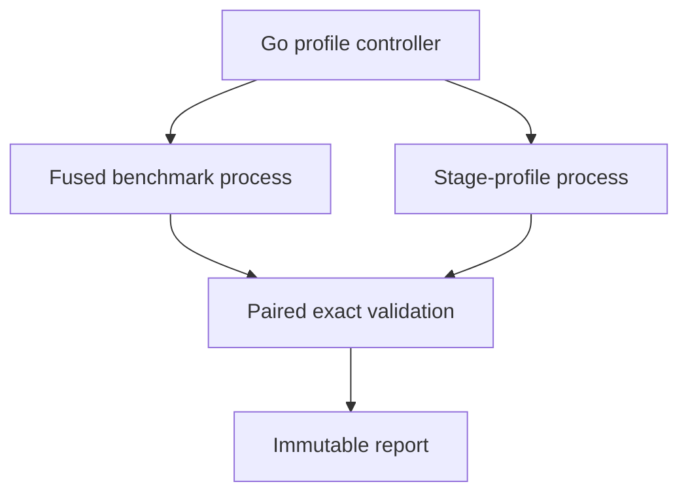

# Architecture overview

## System thesis

ParaFlow keeps one logical batch-analytics workload stable while its execution
evolves from a scalar oracle into a heterogeneous task-DAG runtime.

```text
seeded records -> normalize -> score -> filter/compact -> aggregate
```

The project asks how the same computation should be represented, measured,
scheduled, synchronized, and mapped to scalar CPU, SIMD, multicore CPU, and GPU
hardware. Backend changes must not move workload meaning.

## Language ownership

### Rust engine

Rust owns:

- workload execution and the frozen scalar correctness oracle;
- deterministic generation;
- Day 5 fused sampling and Day 6 materialized stage profiling, with
  per-iteration correctness checks;
- future logical buffers, task graph, worker lifecycle, scheduling,
  synchronization, cancellation, and backpressure;
- future dispatch to native CPU and GPU kernels.

The Day 5 benchmark path materializes `Vec<LogicalRecord>` for a declared
measurement boundary. The type remains internal and does not become a C ABI or
permanent layout.

### Go controller

Go owns:

- host and toolchain diagnostics;
- operating-system process lifecycle;
- versioned suite orchestration;
- strict cross-process validation;
- source, environment, artifact, suite, and workload identity;
- controller/engine revision alignment and in-suite engine immutability checks;
- descriptive statistics, paired profile analysis, and immutable persistence;
- future indexing and optional API exposure.

Go never enters the timed compute loop. It starts one Rust process per scenario,
while Rust executes every warm-up and retained sample inside that process.

### C++ / ISPC / CUDA

The native layer begins in Week 2 and will own:

- scalar C++ comparison kernels;
- SIMD and ISPC kernels;
- CUDA host state and device kernels;
- hardware-specific profiling hooks.

Rust will call it through a narrow C ABI with caller-owned buffers, explicit
lengths and error codes, no crossing exceptions, and opaque handles for device
state.

## Five distinct contracts

ParaFlow separates five concerns:

| Contract    | Purpose                                            | Current status                          |
| ----------- | -------------------------------------------------- | --------------------------------------- |
| Workload    | What records and stages mean                       | `paraflow.workload/v1` frozen           |
| Execution   | Reusable Go-to-Rust correctness transactions       | Day 4 protocol v1 frozen                |
| Measurement | Fused warm-ups, samples, boundaries, and evidence  | Day 5 benchmark v1 frozen               |
| Profiling   | Observer/topology identity and paired analysis      | Day 6 profile/report v1                 |
| Native ABI  | Rust-to-C++ in-memory calls                        | Documented constraints; not implemented |


Keeping them separate prevents worker count, sample count, backend choice, or
physical layout from becoming accidental workload semantics.

## Day 4 correctness process

```text
Go Session
  stdin  -> execute(workload) / shutdown
  stdout <- completed(result) / correlated error / shutdown_ack
  stderr -> continuously drained bounded diagnostics
```

The worker is long-lived and sequential. It proves bounded framing, lossless
transport, correlation, recoverable job errors, and graceful shutdown. It is
not itself a benchmark harness or a task scheduler.

## Day 5 measurement process

| Failure class | Examples                                                                        | Session outcome                                 |
| ------------- | ------------------------------------------------------------------------------- | ----------------------------------------------- |
| Job           | Invalid workload, unsupported backend, execution failure                        | Correlated error; worker reusable               |
| Protocol      | Malformed or oversized frame, wrong schema/kind, correlation or result mismatch | Fatal; process exits or Go poisons and reaps it |
| Transport     | Broken pipe, EOF, in-flight cancellation, write/read failure                    | Fatal; Go poisons and reaps it                  |


```text
Go labctl benchmark
    |
    | one self-contained request per scenario
    v
Rust paraflow-engine benchmark
    |-- untimed streaming-oracle reference
    |-- warm-up iterations
    |-- retained iteration 0
    |-- retained iteration 1
    |-- ...
    `-- exact result check for every iteration
    |
    v
Go validates -> summarizes -> atomically persists complete capture
```

The boundaries are intentionally nested:

```text
orchestration_total
  process start + transport + engine experiment + response validation

engine experiment_total
  all warm-ups + all retained iterations

retained engine_total
  generation + pipeline + exact result check + temporary-buffer reclamation
  + bookkeeping
```

Generation and pipeline durations are also retained separately. Every timing is
encoded as fixed-width hexadecimal nanoseconds. Request and response payloads
share the 4 MiB bound while excluding one optional LF or CRLF terminator.

## Day 6 paired profiling process



The stage-profile process uses an internal materialized pass for normalize,
score, filter, and aggregate. One coarse timer surrounds each pass. Intermediate
buffers make the boundaries observable but change allocation, fusion, and
memory traffic, so the topology and observer are first-class protocol fields.

For every retained sample, the five stage durations sum exactly to
`stage_sum_ns`, and `profile_total_ns` encloses that sum. The profile result must
match both the streaming oracle and the paired fused result exactly. Go retains
both sample sets, enforces identical release build identity, and derives
integer-only analysis.

The materialized-stage/fused-pipeline ratio is descriptive observer context. It
is not a backend speedup.

## Correctness hierarchy

Every future backend must pass, in order:

1. strict parsing and semantic validation;
2. deterministic input identity;
3. stage-level conformance;
4. structural result invariants;
5. the declared floating-point comparison policy;
6. performance measurement only after correctness.

A faster incorrect implementation has no benchmark result.

## Deterministic decomposition foundation

Every generated field is a pure function of seed, absolute record index, and
field ID. There is no shared mutable RNG cursor.

```text
0..N = 0..A + A..B + B..N
```

Partitions can be generated independently without changing record identity.
Day 6 still executes sequentially; Week 3 will exploit this property for
multicore decomposition. The two 64K Day 5 workloads keep every setting equal
except distribution, creating a controlled skew comparison.

## Deliberately deferred decisions

Evidence, not preference, must decide:

- AoS versus SoA;
- alignment, padding, and tiling;
- fused versus materialized stages;
- central queue versus per-worker deques;
- static versus dynamic chunking;
- sleeping versus spinning workers;
- mutex versus lock-free structures;
- CPU versus GPU crossover thresholds.

Day 6 publishes the observer-aware scalar evidence needed to evaluate those
choices without prematurely freezing one of them.
