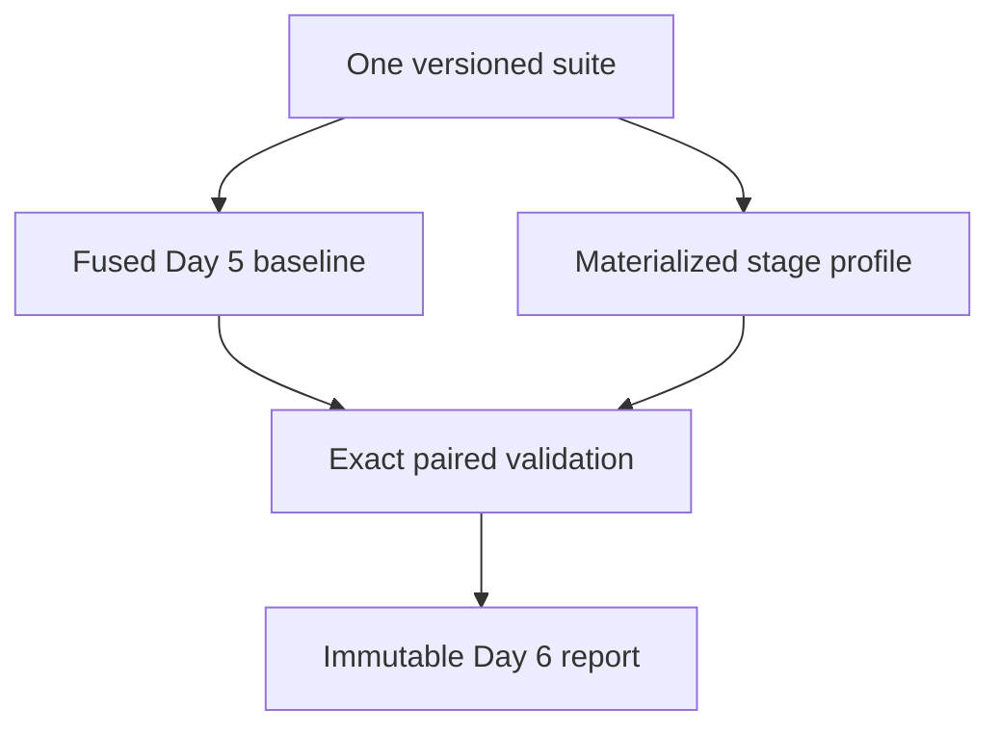

# Day 6 — Explain the scalar baseline

## Objective

Turn the Day 5 scalar denominator into reviewable performance evidence without
optimizing it. Day 6 measures explicit scalar stage passes, pairs them with the
unchanged fused baseline, preserves both raw sample sets, and publishes only the
claims supported by those boundaries.

**Status:** implemented for `v0.1.0-alpha.3`.

## Learning outcome

Day 6 practices the CS149 habit that precedes parallel optimization:

- define the measured topology before interpreting a number;
- place coarse timers where observer cost is bounded and visible;
- keep a trusted fused baseline separate from a diagnostic decomposition;
- retain raw observations and use median/MAD rather than best-of-one;
- control workload variables across size and distribution;
- make correctness, source identity, and artifact identity performance gates;
- convert a profile into testable hypotheses, not universal bottleneck claims.

SIMD, threads, task scheduling, synchronization, and GPUs remain deliberately
out of scope.

## Delivered architecture



For each scenario, `labctl profile` launches two fresh release-engine
processes:

1. `paraflow-engine benchmark` executes the unchanged fused Day 5 path.
2. `paraflow-engine profile` executes generation plus explicit materialized
   normalize, score, filter, and aggregate passes.
3. Go requires the same scenario, workload, sampling policy, backend, build
   identity, source identity, and canonical result.
4. Go derives integer-only statistics and persists one self-contained report.

The stage pass is named `materialized-stage-passes-v1` and its observer is named
`boundary-timers-v1`. Those names travel with every profile result.

## Project structure

```text
benchmarks/suites/
├── day06-profile-smoke-v1.json
└── day06-scalar-profile-v1.json
contracts/
├── profile-request-v1.schema.json
├── profile-engine-result-v1.schema.json
├── profile-vectors-v1.schema.json
├── scalar-profile-report-v1.schema.json
├── understanding-question-set-v1.schema.json
└── conformance/
    ├── profile-v1.json
    └── scalar-profile-report-v1.json
engine-rs/crates/
├── paraflow-protocol/src/profile.rs
└── paraflow-engine/
    ├── src/profile.rs
    ├── src/scalar/mod.rs
    └── tests/profile_v1.rs
labctl-go/internal/benchmark/
├── profile_engine.go
├── profile_execute.go
├── profile_stats.go
├── profile_types.go
└── profile_*_test.go
```

## Design explanation

### Preserve the denominator

Adding timers inside the fused loop would change the implementation being used
as the baseline. Day 6 therefore leaves `paraflow.benchmark-*` untouched and
adds a separate `paraflow.profile-*` family.

### Use coarse stage boundaries

One timer surrounds each complete stage pass. There is no clock read per
record. The profile path materializes intermediate buffers so stage boundaries
exist, which changes memory traffic and fusion behavior. It is diagnostic
evidence, not a decomposition whose values must add to the fused pipeline time.

### Pair evidence before interpretation

The report retains the complete fused engine result and complete stage-profile
engine result. It is rejected unless both exact logical results and all build
identity fields agree. The measured executable is hashed before and after the
suite.

### Keep analysis reproducible

Raw samples are authoritative. Derived fields use integer arithmetic:

- stage medians and median absolute deviations;
- selectivity in basis points;
- stage shares apportioned to exactly 10,000 basis points;
- per-record costs in milli-nanoseconds;
- materialized-stage/fused-pipeline ratio in milli-units.

No binary floating-point report calculation is needed.

## Timing boundaries

| Evidence       | Boundary           | Includes                                                                 |
| -------------- | ------------------ | ------------------------------------------------------------------------ |
| fused baseline | `generation_ns`    | allocation and deterministic logical-record materialization              |
| fused baseline | `pipeline_ns`      | fused normalize through aggregate                                        |
| stage profile  | `generation_ns`    | the same fresh materialization boundary                                  |
| stage profile  | `normalize_ns`     | output allocation and one normalize pass                                 |
| stage profile  | `score_ns`         | output allocation and one score pass                                     |
| stage profile  | `filter_ns`        | accepted-buffer allocation and stable filter pass                        |
| stage profile  | `aggregate_ns`     | histogram allocation and stable aggregation                              |
| stage profile  | `stage_sum_ns`     | exact sum of the five declared stage boundaries                          |
| stage profile  | `profile_total_ns` | generation, stage passes, exact comparison, reclamation, and bookkeeping |

For every retained profile sample:

```text
stage_sum_ns
  = generation_ns
  + normalize_ns
  + score_ns
  + filter_ns
  + aggregate_ns

profile_total_ns >= stage_sum_ns
```

The report includes `stage_pass_to_fused_pipeline_ratio_milli`, but the field is
an observer/topology ratio. It must never be labeled a speedup.

## Implementation plan completed

1. Freeze separate profile wire contracts and portable fixtures.
2. Add fallible internal stage buffers and coarse Rust timers.
3. Check every warm-up and retained profile result against the streaming scalar
   oracle.
4. Add strict Go process control, correlation, timing-conservation, source, and
   build validation.
5. Pair the fused baseline with the profile for every suite scenario.
6. Derive reproducible integer-only analysis while retaining all raw samples.
7. Persist atomically without overwrite and recheck the engine artifact hash.
8. Add release-process integration, schema rejection, race, and CLI tests.
9. Add the Day 6 CS149 understanding-question set and schema.
10. Publish a curated machine-specific report only from a clean commit.

## Tests

`make check` covers:

- closed Draft 2020-12 schemas and semantic rejection cases;
- strict Rust and Go decoding of shared profile vectors;
- exact fused/materialized result equality, including empty input;
- warm-up and retained-sample counts;
- exact stage-sum and nested-boundary conservation;
- overflow-safe integer analysis and stable basis-point apportionment;
- source/build mismatch and engine mutation rejection;
- atomic no-overwrite persistence;
- real release Go-to-Rust profile execution;
- Go race detection, Rust Clippy, formatting, unit, and integration tests.

`make profile-smoke` additionally creates and validates disposable paired
evidence without imposing a latency threshold.

## Benchmark setup

```bash
make profile-smoke
make profile-day06
```

The full suite uses the same 1K, 64K uniform, 64K hotspot, and 1M workloads as
Day 5. Each scenario uses five warm-ups and 20–25 retained samples in both
topologies. The command creates a new file under `results/raw/` and refuses to
replace earlier evidence.

Direct invocation:

```bash
./bin/labctl profile \
  --engine ./target/release/paraflow-engine \
  --suite benchmarks/suites/day06-scalar-profile-v1.json \
  --output results/raw/my-day06-profile.json \
  --repository-root .
```

## Expected GitHub outcome

The branch demonstrates one continuous project rather than a standalone
profiler:

- Day 3 scalar semantics remain the oracle.
- Day 4 lossless result types are reused.
- Day 5 fused measurement remains the comparison denominator.
- Day 6 adds an explicit diagnostic topology and a self-contained paired report.
- The same workloads and evidence rules are ready for later C++/ISPC SIMD
  backends and Rust runtime experiments.

The implementation is organized into reviewable protocol, engine, controller,
learning/quality, documentation, and report commits.

## Limitations and non-claims

- Stage passes change fusion, allocation, and memory-access behavior.
- Boundary timers and materialized intermediates have observer cost.
- No hardware counters, CPU affinity, NUMA control, or fixed frequency policy
  are present.
- One host's timings do not generalize to another host.
- A dominant materialized stage is a hypothesis for later experiments, not
  proof of the fused loop's universal bottleneck.
- No parallel speedup claim is possible because Day 6 adds no parallel backend.

## Foundation for Day 7

Day 7 can harden reproducibility and cut the scalar `v0.1` baseline without
changing workload semantics, the fused denominator, or the observer-aware
profile contract.
