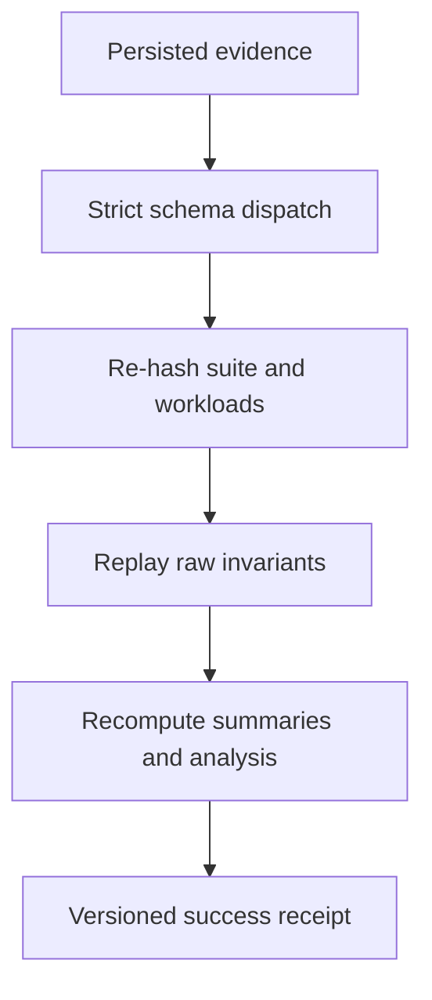

# Day 7 — Qualify the Week 1 scalar release

## Objective

Seal the continuous Day 1–6 implementation as a reviewable `v0.1.0` scalar
checkpoint before native or parallel backends begin. Day 7 adds no faster
compute path. It makes the existing correctness and performance evidence
independently verifiable, hardens failure behavior, aligns release identity,
and turns all quality gates into one reproducible release command.

**Status:** implemented for `v0.1.0`.

## Learning outcome

Day 7 applies systems-performance discipline that is directly useful in senior
backend and systems interviews:

- distinguish measurement, validation, verification, and reproduction;
- make raw observations authoritative over derived statistics;
- use content identity and source identity as separate provenance layers;
- fail closed on ambiguous schemas or inconsistent evidence;
- scope performance claims to the machine and boundary that produced them;
- design CI around deterministic invariants rather than noisy latency gates;
- cut a stable reference release before changing layout or execution strategy.

SIMD, threads, tasks, synchronization, and GPU execution remain out of scope.

## Project structure

```text
.
├── VERSION
├── CHANGELOG.md
├── contracts/
│   ├── evidence-verification-v1.schema.json
│   └── conformance/evidence-verification-v1.json
├── docs/
│   ├── adr/0008-offline-verification-and-release-qualification.md
│   └── plans/day-07.md
├── labctl-go/internal/
│   ├── app/                     # verify command and CLI failure contract
│   └── benchmark/
│       ├── verify.go            # evidence replay and receipt
│       └── verify_test.go       # real report plus adversarial mutations
├── results/day07/
│   └── day07-evidence-verification.json
└── tools/check-version.sh
```

Every file extends the same workload, engine, controller, and evidence model.
There is no Day 7 toy executable.

## Design explanation

### Verification does not collect timing

`labctl verify` never starts the Rust engine. It authenticates deterministic
parts of an existing artifact:



This makes the claim precise: nanosecond samples came from the recorded host;
the current verifier proves that those retained samples, identities, and
derivations are internally consistent.

### Trust is layered

| Layer                | Day 7 check                                                       |
| -------------------- | ----------------------------------------------------------------- |
| shape                | strict decoding, duplicate-key rejection, unknown-field rejection |
| repository content   | suite and workload path confinement plus SHA-256                  |
| raw compute evidence | exact result decoding and engine timing invariants                |
| provenance           | controller/environment/source/build alignment                     |
| derived evidence     | median/MAD, stage summaries, shares, ratios, and analysis replay  |
| engine bytes         | optional explicit SHA-256 comparison                              |
| release identity     | root version, Cargo packages, Go/Rust binary outputs              |

The receipt sets `engine_artifact_verified` only when actual bytes were
supplied. A stored digest alone is never mislabeled as a byte comparison.

### Failure is read-only

Unsupported schemas, unknown fields, duplicate keys, path escape, content
drift, impossible timings, mixed builds, rewritten summaries, rewritten
analysis, and engine mismatch return a nonzero result. Verification does not
repair, delete, or overwrite the source artifact and emits no passing receipt.

## Implementation plan completed

1. Add a closed evidence discriminator and a versioned verification receipt.
2. Reuse the existing Go benchmark/result validators rather than create a
   second definition of Day 5/6 invariants.
3. Re-hash repository-backed suite/workload inputs and compare their projected
   dimensions with stored identity.
4. Recompute every raw-sample summary and paired profile analysis.
5. Add optional current-engine byte verification with an explicit receipt bit.
6. Add CLI human/JSON modes and invalid-argument/failure exit contracts.
7. Centralize `0.1.0` and verify every compiled/package version.
8. Promote evidence and version checks into `make check`, CI, and
   `make release-check`.
9. Add adversarial tests, documentation, ADR, changelog, and 24 cumulative
   understanding questions.
10. Create one clean release commit and annotated `v0.1.0` tag.

## Complete implementation map

| Requirement        | Implementation                                                                         |
| ------------------ | -------------------------------------------------------------------------------------- |
| GitHub-ready code  | focused Go verifier package, stable CLI, versioned JSON schema                         |
| clean architecture | Go owns evidence orchestration; Rust compute contracts remain unchanged                |
| tests              | unit, real-artifact, mutation, CLI, schema, race, and cross-language integration gates |
| benchmarks         | unchanged Day 5/6 suites plus disposable paired smoke; no new threshold                |
| README             | release outcome, commands, trust boundary, limitations, and next milestone             |
| meaningful history | evidence, release, learning, documentation, and qualification commits                  |
| future foundation  | tagged scalar oracle and denominator for C++ scalar then SIMD work                     |

## Tests

`make check` covers all Day 1–6 tests plus:

- strict decoding of both supported evidence variants;
- replay of the checked-in 190-sample Day 6 report;
- SHA-256 suite/workload identity and repository path confinement;
- exact raw result and timing-boundary validation;
- source/version/build stability across all scenarios;
- summary and integer-only analysis recomputation;
- rewritten summary, unknown field/schema, and engine mismatch rejection;
- optional engine-byte verification;
- verification receipt JSON Schema and negative cases;
- root/Cargo/Go/Rust version alignment;
- Go race detection for the new verifier and CLI path.

`make release-check` additionally executes `make profile-smoke`. The smoke run
must produce structurally and semantically valid paired evidence, but shared CI
does not assert a fixed latency or speedup.

## Benchmark and verification setup

Verify curated historical evidence:

```bash
make evidence-check

./bin/labctl verify \
  --json \
  --repository-root . \
  results/day06/day06-scalar-profile-df96257.json
```

Verify engine bytes only when the supplied artifact is exactly the captured
binary:

```bash
./bin/labctl verify \
  --json \
  --repository-root . \
  --engine ./target/release/paraflow-engine \
  results/raw/report-from-this-exact-build.json
```

Run the complete release qualification:

```bash
make release-check
```

Measure verifier overhead separately from compute benchmarks:

```bash
make evidence-benchmark
```

That Go benchmark includes strict decoding, repository file reads/hashes, raw
validation, and summary/analysis replay for the checked-in 190-sample report.
It is diagnostic tooling overhead, not a workload speedup measurement.

## README and documentation update

The root README now leads with `v0.1.0`, documents offline verification and its
engine-byte limitation, lists the release gates, and points Week 2 at the same
oracle. ADR 0008 records why verification is separate from measurement.
`CHANGELOG.md` gives reviewers a release-level implementation summary.

## Meaningful commit structure

1. `day 7: evidence: add offline report verification`
2. `day 7: release: centralize version and qualification gates`
3. `day 7: learning: add release qualification questions`
4. `day 7: docs: publish the Week 1 v0.1.0 checkpoint`
5. `day 7: report: record clean release qualification`

The annotated `v0.1.0` tag points at the final clean qualification commit.

## Expected GitHub outcome

Reviewers can clone one repository, inspect the evolution from contract to
scalar engine to cross-language evidence, run `make release-check`, and audit
the checked-in report without trusting a spreadsheet or prose-only claim.
Later backends inherit:

- frozen workload semantics;
- schedule-independent input generation;
- a typed Rust scalar oracle;
- lossless Go/Rust result transport;
- explicit benchmark/profile boundaries;
- immutable raw evidence and replayable derivations;
- a named, tagged scalar comparison point.

## Limitations and non-claims

- Offline verification does not reproduce historical nanosecond values.
- Historical engine bytes are not stored in Git; their digest remains recorded.
- No affinity, NUMA, fixed-frequency, or hardware-counter policy is added.
- Stage-pass profiling still changes allocation, fusion, and memory behavior.
- `v0.1.0` proves a qualified scalar foundation, not parallel performance.

## Foundation for Week 2

The next milestone can introduce a narrow C ABI and C++ scalar backend while
holding workload meaning, exact results, benchmark boundaries, and the
`v0.1.0` Rust denominator constant. SIMD begins only after that scalar native
path passes the existing oracle.
